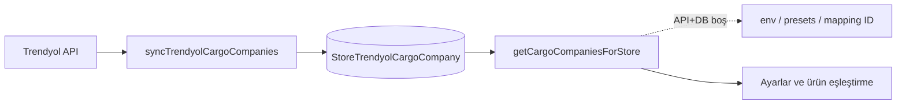

# Trendyol kargo (`cargoCompanyId`) entegrasyonu

Bu doküman, Trendyol ürün yayını için **kargo firması seçimi** ve **`cargoCompanyId`** alanının nasıl beslendiğini özetler.

## Amaç

- Kullanıcının **sayısal ID’yi elle bilmesini** gerektirmemek.
- Diğer entegratörlerde olduğu gibi **okunabilir isimlerle** (ör. “Sürat Kargo Marketplace”) seçim sunmak.
- **Tek kaynak**: mağaza bazlı `StoreTrendyolCargoCompany` tablosu (Trendyol API ile senkron).
- API erişilemezse **yedek**: `TRENDYOL_CARGO_COMPANY_IDS`, `TRENDYOL_MP_CARGO_PRESETS`, gerektiğinde eşleştirmede kullanılmış ek ID’ler.

## Veri modeli

| Konu | Açıklama |
|------|-----------|
| `StoreTrendyolCargoCompany` | Mağaza + `cargoCompanyId` benzersiz; `name`, `rawData`, `lastSyncedAt`. Senkron kaynağı: Trendyol API (`syncTrendyolCargoCompanies`). |
| `ProductMarketplaceMapping.cargoCompanyId` | Ürün bazında seçilen Trendyol **sayısal** kargo firması ID’si. |
| `MarketplaceConnection.defaultCargoCompanyId` | Mağaza varsayılanı; ürün eşleştirmede otomatik önerilir. |

İlgili migration: `prisma/migrations/20260403120000_add_store_trendyol_cargo_company/migration.sql`, `prisma/migrations/20260402130000_add_default_cargo_company_id_to_marketplace_connection/migration.sql`

## Çekirdek modüller

### `src/lib/trendyol/getCargoCompaniesForStore.ts`

- **`getCargoCompaniesForStore({ userId, storeId, extraCargoCompanyIds? })`**: Tek resolver.
  1. `StoreTrendyolCargoCompany` doluysa → `source: "db"`.
  2. Boşsa ve bağlantı aktifse → `syncTrendyolCargoCompanies` (Trendyol API → upsert) → tekrar DB.
  3. Hâlâ boşsa → `TRENDYOL_CARGO_COMPANY_IDS` + `TRENDYOL_MP_CARGO_PRESETS` (`fallback-env` / `fallback-preset`); sadece geçmiş mapping ID’leriyle doluyorsa `fallback-mapping`.
- **`mergeExtraCargoIds`**: Eski birleştirme mantığı için dışa açık; ürün API’si çoğunlukla `extraCargoCompanyIds` ile aynı işi tek çağrıda yapar.

### `src/lib/trendyol/syncTrendyolCargoCompanies.ts`

- Ürün sağlayıcı uçları + `fetchTrendyolCarrierCompaniesForStore` yanıtlarını `trendyolCargoNormalize` ile satıra çevirir, **upsert** (idempotent).

### `src/lib/trendyol/trendyolCargoNormalize.ts`

- API yanıtlarından `{ cargoCompanyId, name, rawData }` üretir.

### `src/lib/trendyolCargoPresets.ts`

- **Yalnızca yedek etiket** ve env ID’leri için isim çözümü (`trendyolCargoPresetLabel`); birincil liste değildir.

### `src/lib/trendyolCarrier.ts`

- `fetchTrendyolCarrierCompaniesForStore` — senkron servisi tarafından kullanılır.

## API uçları

### `GET /api/integrations/trendyol/product-providers`

- Yetki: `marketplace.integrations.manage`, aktif Trendyol bağlantısı.
- `getCargoCompaniesForStore` → `options`, `source`, `data`, `apiReachable` (`source === "db"`), `carrierAttempts`, `primaryOk`, `primaryStatus`.

### `POST /api/integrations/trendyol/cargo-companies/sync`

- Trendyol API → DB senkronu (ayarlar ve ürün eşleştirmedeki “yenile”).

### `GET /api/products/[id]/trendyol-mapping`

- `cargoCompanyOptions`: `{ id, label }[]` — resolver + mağazada kullanılmış ek ID’ler.
- Varsayılan: `MarketplaceConnection.defaultCargoCompanyId` veya listenin ilk uygun değeri.

### `POST /api/integrations/trendyol/connection`

- `defaultCargoCompanyId` (opsiyonel).

## Arayüz

### `src/app/(dashboard)/settings/trendyol/page.tsx`

- “Kargo listesini senkronize et” → `POST .../cargo-companies/sync`, ardından liste.
- “Listeyi yenile” → `GET product-providers` (DB + gerekirse otomatik sync + yedekler).

### `src/components/products/ProductTrendyolMappingSection.tsx`

- “Listeyi yenile” → aynı senkron uç noktası, sonra mapping yeniden yüklenir.

## Ortam değişkeni

| Değişken | Amaç |
|----------|------|
| `TRENDYOL_CARGO_COMPANY_IDS` | Yedek ID listesi (API/DB yoksa). Birincil kaynak değildir. |

## Akış özeti

## Yayın tarafı

`src/lib/trendyolCreateProductPayload.ts`: `cargoCompanyId` yoksa veya geçersizse **hata**; payload’da yalnızca **sayı** gider; etiket gönderilmez.

---

*Son güncelleme: StoreTrendyolCargoCompany tabanlı mimari.*
